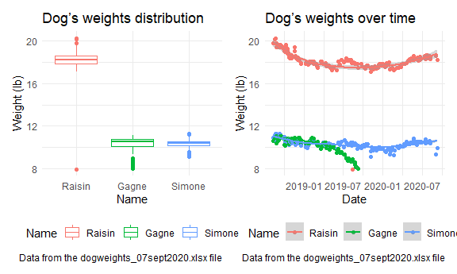

Midterm project
================
Cong Zhang
2020-10-25

This is my solution to Midterm project.

``` r
library(tidyverse)
library(readxl)
library(patchwork)

knitr::opts_chunk$set(
    fig.width = 6, 
  fig.asp = .6,
  out.width = "90%"
)

theme_set(theme_minimal() + theme(legend.position = "bottom"))

options(
  ggplot2.continuous.colour = "viridis",
  ggplot2.continuous.fill = "viridis"
)

scale_colour_discrete = scale_colour_viridis_d
scale_fill_discrete = scale_fill_viridis_d
```

``` r
wordcountaddin::text_stats("p8105_mtp_cz2612.Rmd")
```

| Method          | koRpus      | stringi       |
| :-------------- | :---------- | :------------ |
| Word count      | 34          | 31            |
| Character count | 218         | 218           |
| Sentence count  | 6           | Not available |
| Reading time    | 0.2 minutes | 0.2 minutes   |

## Problem 1

Read dogweights dataset.

``` r
dogweights_stat_df = 
  read_xlsx(
        "./data/dogweights_07sept2020.xlsx",
        skip = 1) %>% 
  janitor::clean_names() %>%
  separate(raisin, into = c("raisin_lb", "raisin_oz"), sep = 2) %>% 
  separate(simone, into = c("simone_lb", "simone_oz"), sep = 2) %>% 
  separate(gagne, into = c("gagne_lb", "gagne_oz"), sep = 2) %>% 
  separate(std, into = c("std_lb", "std_oz"), sep = 2) %>%  
  mutate(
    date = as.numeric(date),
    date = as.Date(date, origin = "1899-12-30"),
    raisin_lb = as.numeric(raisin_lb) + as.numeric(raisin_oz) / 16,
    simone_lb = as.numeric(simone_lb) + as.numeric(simone_oz) / 16,
    gagne_lb = as.numeric(gagne_lb) + as.numeric(gagne_oz) / 16,
    std_lb = as.numeric(std_lb) + as.numeric(std_oz) / 16,
  ) %>% 
  select(date, raisin_lb, simone_lb, gagne_lb, std_lb) %>% 
  filter(!is.na(date)) %>% 
  filter(!(is.na(raisin_lb) & is.na(simone_lb) & is.na(gagne_lb)))
```

    ## New names:
    ## * `` -> ...6

``` r
dogweights_notes_df = 
  read_xlsx(
        "./data/dogweights_07sept2020.xlsx",
        skip = 1) %>% 
  janitor::clean_names() %>%
  select(date, notes = x6) %>% 
  mutate(
    date = as.numeric(date),
    date = as.Date(date, origin = "1899-12-30"),
  ) %>% 
  filter(!is.na(notes))
```

    ## New names:
    ## * `` -> ...6

Export dataframes as CSVs.

``` r
write_csv(dogweights_stat_df,"./data/dogweights_stat.csv")
write_csv(dogweights_notes_df,"./data/dogweights_notes.csv")
```

## Problem 2

Make summary table.

``` r
dogweights_stat_df %>% 
  select(raisin_lb:gagne_lb) %>% 
  pivot_longer(
    raisin_lb:gagne_lb,
    names_to = "name",
    values_to = "weight"
  ) %>% 
  mutate(
    name = str_replace(name, "raisin_lb", "Raisin"),
    name = str_replace(name, "simone_lb", "Simone"),
    name = str_replace(name, "gagne_lb", "Gagne"),
    ) %>% 
  group_by(name) %>% 
  summarize(
    weight_obs = sum(!is.na(weight)),
    weight_avg = mean(weight, na.rm = TRUE),
    weight_sd = sd(weight, na.rm = TRUE)
  ) %>% 
  knitr::kable(digits = 2)
```

    ## `summarise()` ungrouping output (override with `.groups` argument)

| name   | weight\_obs | weight\_avg | weight\_sd |
| :----- | ----------: | ----------: | ---------: |
| Gagne  |         119 |       10.29 |       0.71 |
| Raisin |         201 |       18.23 |       0.98 |
| Simone |         192 |       10.38 |       0.38 |

There are 201 unique dates included in the tidy dataset.

## Problem 3

Make plots.

``` r
weight_distr_plot =
  dogweights_stat_df %>% 
  select(date, raisin_lb:gagne_lb) %>% 
  pivot_longer(
    raisin_lb:gagne_lb,
    names_to = "name",
    values_to = "weight"
  ) %>% 
  mutate(
    name = str_replace(name, "raisin_lb", "Raisin"),
    name = str_replace(name, "simone_lb", "Simone"),
    name = str_replace(name, "gagne_lb", "Gagne"),
    name = as.factor(name),
    name = fct_reorder(name, weight)
  ) %>%
  ggplot(aes(x = name, y = weight, color = name)) +
  geom_boxplot() +
  labs(
    title = "Dog’s weight distribution",
    x = "Dog's name",
    y = "Weight (lb)",
    caption = "Data from the dogweights_07sept2020.xlsx file"
  ) +
  scale_color_hue(name = "Dog's name")

weight_time_plot =
  dogweights_stat_df %>% 
  select(date, raisin_lb:gagne_lb) %>% 
  pivot_longer(
    raisin_lb:gagne_lb,
    names_to = "name",
    values_to = "weight"
  ) %>% 
  mutate(
    name = str_replace(name, "raisin_lb", "Raisin"),
    name = str_replace(name, "simone_lb", "Simone"),
    name = str_replace(name, "gagne_lb", "Gagne"),
    name = as.factor(name),
    name = fct_reorder(name, weight)
  ) %>%
  ggplot(aes(x = date, y = weight, color = name)) +
  geom_point() +
  geom_smooth() +
  labs(
    title = "Dog’s weight over time",
    x = "Date",
    y = "Weight (lb)",
    caption = "Data from the dogweights_07sept2020.xlsx file"
  ) +
  scale_color_hue(name = "Dog's name")

weight_distr_plot + weight_time_plot
```

    ## `geom_smooth()` using method = 'loess' and formula 'y ~ x'


